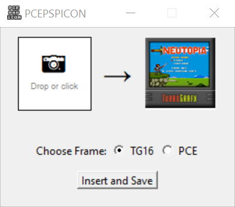

# PCEPSPICON

PCEPSPICON - tool written in Python that converts your image (box art, title screen) into a psp icon.\
You can then use the successfully converted `ICON0.PNG` to create the pce-psp iso image via other tools.

## Features 

- Drag'n'Drop your image
- 2 Frames: TurboGrafx-16 (USA) and PC Engine (JP)
- Simple to use
 
## Screenshot




## Download

Standalone Windows executable (EXE x64) available **→ [here](https://github.com/Xalk07/PCEPSPICON/releases) ←**


## Building

Install Python 3.8+ and the required libraries:

```
pip install pyinstaller pillow tkinterdnd2
```
Build the standalone executable:

```
pyinstaller --onefile --noconsole --icon=PCEPSPICON.ico --add-data "base64img.txt;." PCEPSPICON_1.0.py
```

Xalk07 (+███❖) 2025
